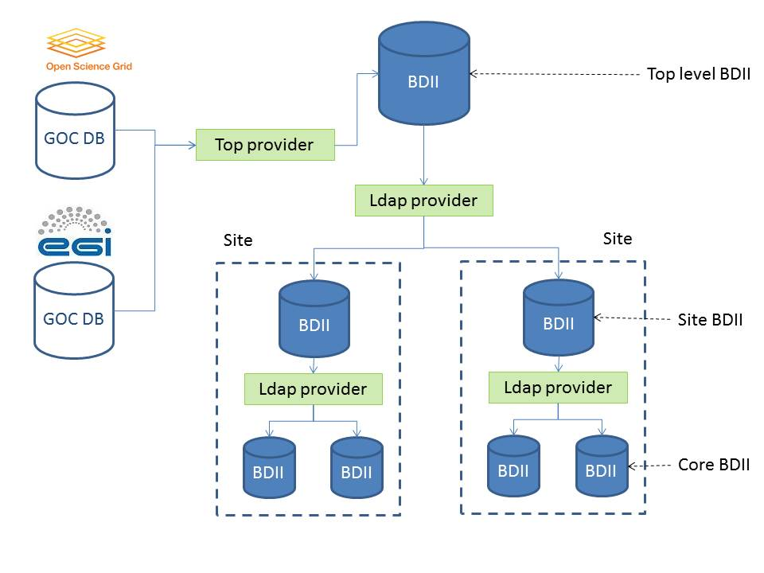

Grid Information System Introduction
====================================

The grid information system is a mission-critical component in the WLCG grid
infrastructure. It provides detailed information about grid services which is
needed for various different tasks. The grid information system has a
hierarchical structure of three levels. The fundamental building block used in
this hierarchy is the Berkley Database Information Index (BDII). Although the
BDII has additional complexity, it can be visualized as an LDAP database. The
resource level or core BDII is usually co-located with the grid service and
provides information about that service. Each grid site runs a site level BDII.
This aggregates the information from all the resource level BDIIs running at
that site. The top level BDII aggregates all the information from all the site
level BDIIs and hence contains information about all grid services. There are
multiple instances of the top level BDII in order to provide a fault tolerant,
load balanced service. The information system clients query a top level BDII to
find the information that they require.

The BDIIs are populated with information by running information providers.
These are scripts which obtain information, format it as LDIF and print the
result to standard out. These information providers can also be used to query
other BDIIs which is how the hierarchy is built. The order in which these
information providers are run is random.

The information in the information systems conforms to a schema called the GLUE
schema. The GLUE schema started as collaboration effort between European and US
grid projects to facilitate interoperation between them. The Open Grid Forum
(OGF) is now responsible for the GLUE schema.

The information system is bootstrapped from the information registered in the
Operations Databases of EGI and OSG grid infrastructures (GOCDB and OIM). When
a site registers, it enters the URL for the site level BDII into the GOCDB/OIM.
GOCDB/OIM then generates a list of LDAP URLs for all the sites in the grid and
this is downloaded by the information provider running on the top level BDII.
These URLs are then used to query all the site level BDII and the result is
used to populate the top level BDII.
